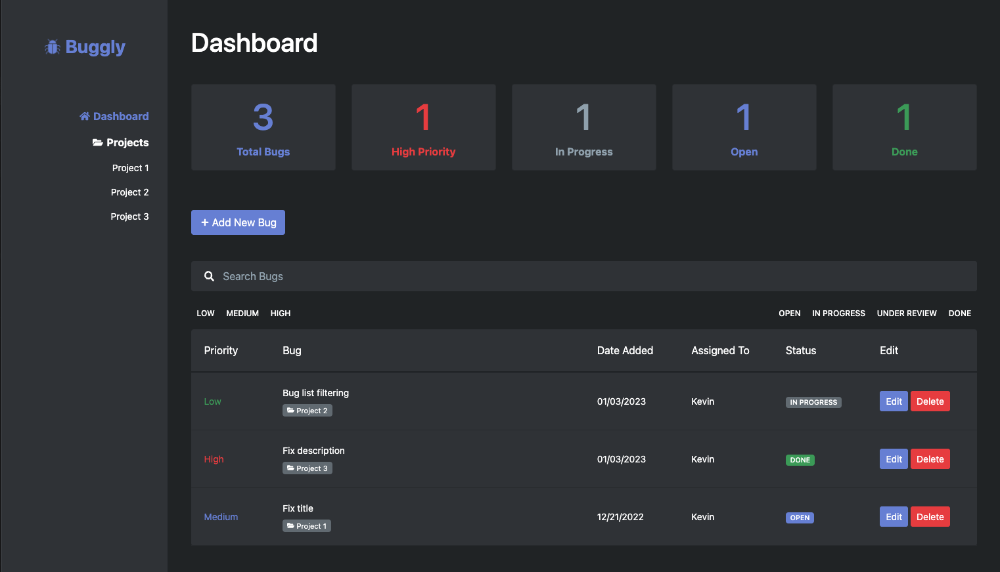

# Buggly - Bug Tracker

A bug tracking project built with React

## Preview

## Technologies

### Front-End
- React
- React Router
- Redux
- Javascript
- HTML
- React Bootstrap
- CSS Modules (SCSS)

### Back-End
- Firebase/Firestore for the database (Local only)

## Demo

<a href="https://trankevin.com/buggly/" target="_blank">https://trankevin.com/buggly/</a>

_Note: Online demo is not connected to the database, so changes made will not persist after page reload_